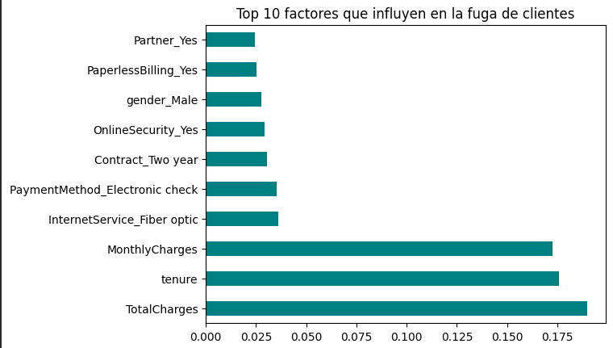

# 📉 Predicción de Abandono de Clientes (Telco Customer Churn)

Este proyecto aplica técnicas de **Machine Learning** para identificar clientes en riesgo de cancelar su servicio en una empresa de telecomunicaciones. El objetivo es proporcionar información accionable para reducir la tasa de rotación (churn).

## 🛠️ Tecnologías y Herramientas
* **Lenguaje:** Python 3.12
* **Entorno:** Google Colab / Jupyter Notebooks
* **Librerías principales:** Pandas, Scikit-Learn, Matplotlib, Seaborn
* **Algoritmo:** Random Forest Classifier

## 📂 Estructura del Proyecto
* `data/`: Dataset original (CSV).
* `notebooks/`: Jupyter Notebook con el análisis completo y limpieza de datos.
* `docs/`: Capturas de pantalla y visualizaciones de resultados.
* `src/`: Scripts de procesamiento (en desarrollo).

## 📊 Resultados y Análisis
El modelo de Inteligencia Artificial fue entrenado y evaluado con los siguientes resultados:

* **Precisión Final (Accuracy):** 79% (aprox.)
* **Hallazgo Clave:** Las variables más influyentes en la fuga son los **Cargos Totales**, la **Antigüedad (Tenure)** y el **Costo Mensual**.
* **Observación:** Se detectó que los clientes con servicio de Fibra Óptica tienen una tendencia mayor al abandono, lo que sugiere un área de mejora en el servicio técnico o comercial de ese sector.

### Importancia de las Variables
 

## 🚀 Cómo ejecutar el proyecto
1. Clonar el repositorio: `git clone https://github.com/maidana99edg/customer-churn-prediction.git`
2. Instalar dependencias: `pip install pandas scikit-learn matplotlib seaborn`
3. Abrir el notebook en `notebooks/` y ejecutar las celdas.

---
**Autor:** Edgar Maidana - Estudiante de Lic. en Informatica.
